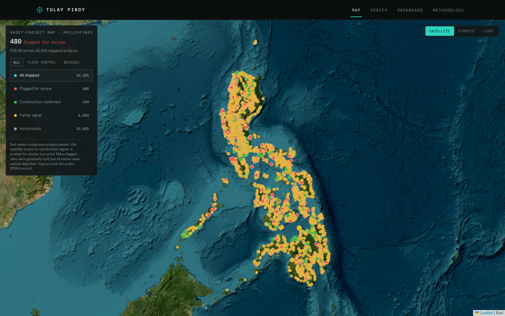
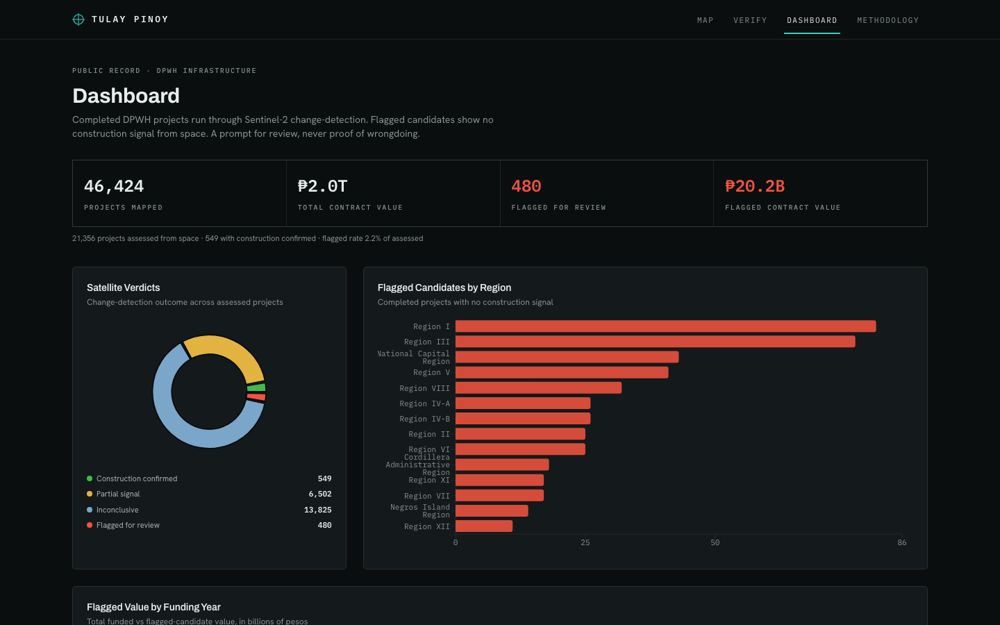
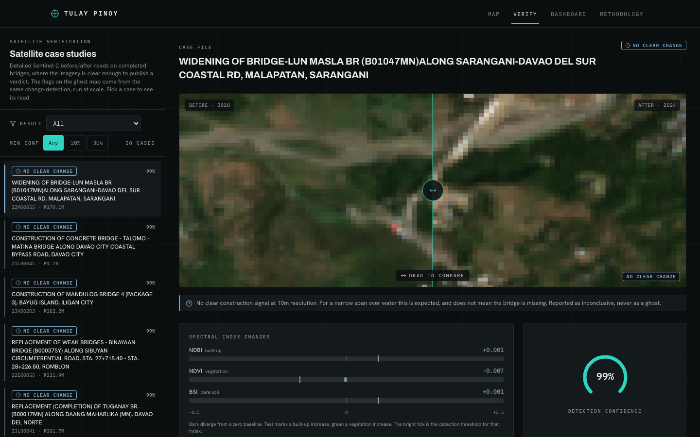
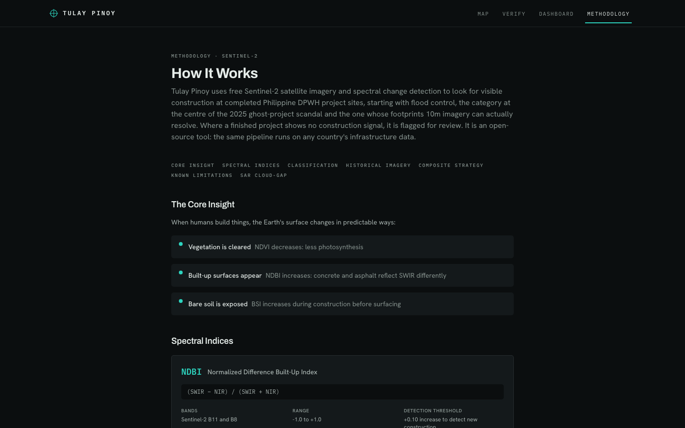
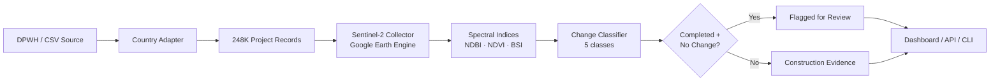

# GhostWatch

[](LICENSE)
[](https://www.python.org/downloads/)
[](https://nextjs.org/)

Satellite verification of public infrastructure: see whether it was built, from space.

GhostWatch is an open-source tool. Point it at a government's infrastructure records and it cross-references each project against free Sentinel-2 satellite imagery, computing before/after spectral change to look for visible construction. It ships as a Python pipeline, a FastAPI backend, and a Next.js dashboard you can clone and run locally against the full 248,220-project Philippine DPWH dataset (PHP 6.38 trillion in contracts, 214,747 geolocated sites).

**Live: [tulaypinoy.ph](https://tulaypinoy.ph)** is a fully static build of this tool, deployed on Vercel with no backend, that turns the satellite check into a ghost-project map. It leads with flood control: the category at the centre of the Philippines' 2025 ghost-project investigations, and the footprint 10m imagery can actually resolve. Every completed flood-control project is run through Sentinel-2 change detection. Where a finished project shows no construction signal it is flagged for review (480 flagged, PHP 20.2 billion), shown in red next to the projects where construction is confirmed from space (549) and the wider DPWH record (42,305 projects mapped). Bridges are mapped alongside as context. A flagged project is a candidate for review, never an accusation. The Python pipeline bakes the real record into static JSON the site reads off the edge.

<p align="center">
  
</p>

<p align="center"><em><a href="https://tulaypinoy.ph">tulaypinoy.ph</a>: completed DPWH flood-control projects checked from space, the ones with no construction signal flagged for review in red, with on-demand historical imagery for every project.</em></p>

### What the satellite actually shows

At 10-meter resolution, free optical satellite picks up construction on large footprints (cleared ground, new built-up) but cannot resolve thin or small structures. As a plain built-or-not test it over-flags badly: run as a binary check on completed flood-control projects, it flags two-thirds to four-fifths of them, because most flood-control work (concrete on an already-bare riverbank) barely moves the built-up index. So the map does not use that raw flag. Every assessed project gets a continuous anomaly score, and only the strongest tail (completed projects where the built-up index actually held flat or fell) is shown in red as flagged for review: 480 of 21,356 assessed flood-control projects, about 2 percent, a deliberately conservative cut (the government's own Independent Commission for Infrastructure confirmed roughly 5 percent of the flood-control projects it reviewed as ghosts). The opposite tail, 549 projects showing clear new clearing and built-up, is marked construction confirmed; the rest is partial or inconclusive. A flagged project is a prompt for review, not a verdict: many flagged sites were genuinely built but sit below what 10m can resolve, which is why every project also opens an on-demand historical before/after from the Esri World Imagery Wayback archive (2014 to today) to inspect by eye.

### Screenshots

| Interactive Map | Analytics Dashboard |
|:---:|:---:|
|  |  |

| Satellite Case Studies | Methodology |
|:---:|:---:|
|  |  |

<p align="center"><em>A remote-sensing instrument console: completed DPWH projects on a satellite basemap with flagged candidates in red, ghost-rate and budget analytics, before/after spectral comparison, and the full methodology.</em></p>

---

## The Problem

Ghost projects (government contracts reported as complete with no physical evidence of construction) represent a documented accountability gap across public infrastructure programs. Manual field audits cost thousands of dollars per site and realistically cover less than 1% of active contracts. With PHP 6.38 trillion spread across 248,220 DPWH projects and only 11,161 contractors on record, the gap between reported and verifiable completion cannot be closed by inspection alone.

Sentinel-2 satellite imagery revisits every point on Earth every five days at 10-meter resolution, free of charge. GhostWatch automates what a field auditor does, comparing before and after, at the scale of a national infrastructure program.

> **Disclaimer:** Verification results are based on automated satellite analysis and may contain errors. A project flagged for review is a statistical indicator that warrants further investigation; it is not a finding of fraud or irregularity. Construction of small structures, underground works, or projects completed outside the satellite acquisition window may not be detectable at 10-meter resolution. All source data is public record. Conclusions about individual projects must not be drawn without independent manual verification.

---

## How It Works



1. Load project records via a country adapter (Philippines, CSV generic, or custom)
2. Collect Sentinel-2 cloud-masked composites for the before and after periods via Google Earth Engine
3. Compute NDBI, NDVI, and BSI from Sentinel-2 band reflectances
4. Calculate change metrics: `after_index − before_index` for each band
5. Classify the site: CONSTRUCTION_DETECTED, VEGETATION_CLEARED, PARTIAL_CONSTRUCTION, NO_CHANGE, or INSUFFICIENT_DATA
6. Flag for review: projects with `status=completed` + `NO_CHANGE` + confidence ≥ 0.70

---

## Installation

```bash
git clone https://github.com/xmpuspus/ghostwatch
cd ghostwatch

# Python library + CLI
pip install -e .

# With web API (FastAPI + uvicorn)
pip install -e ".[web,dev]"

# Frontend (requires Node 20+)
cd web && npm install
```

Google Earth Engine satellite features require authentication:

```bash
earthengine authenticate
# Then set GHOSTWATCH_GEE_PROJECT in your .env
```

---

## Quick Start

```bash
# 1. Download 248K Philippine DPWH projects
ghostwatch fetch --adapter philippines --output data/raw

# Downloading DPWH dataset from HuggingFace...
# Downloaded 47.3 MB to data/raw/dpwh_projects.parquet
# Parsed 248,220 records, skipped 18
# 214,747 records with coordinates (86.5%)

# 2. Verify a single project location
ghostwatch verify 14.5995 120.9842 \
  --before 2022-01-01,2022-06-30 \
  --after 2023-01-01,2023-06-30 \
  --status completed

# {
#   "lat": 14.5995,
#   "lon": 120.9842,
#   "classification": "no_change",
#   "confidence": 0.847,
#   "flagged_for_review": true,
#   "flag_reason": "completed_no_satellite_change",
#   "metrics": {
#     "ndbi_change": 0.012,
#     "ndvi_change": -0.008,
#     "bsi_change": 0.003
#   },
#   "before_indices": {"ndbi": -0.143, "ndvi": 0.312, "bsi": -0.201},
#   "after_indices":  {"ndbi": -0.131, "ndvi": 0.304, "bsi": -0.198}
# }

# 3. Launch the web dashboard
ghostwatch serve           # API on :8000
cd web && npm run dev      # UI on :3000
```

---

## Live deployment: tulaypinoy.ph

[tulaypinoy.ph](https://tulaypinoy.ph) is a separate outcome from the local tool above: a **fully static** snapshot served by Vercel with no backend. The Python pipeline runs once at build time and bakes the real DPWH record plus satellite change-detection into static files the Next.js app reads directly. It leads with **flood control**, the category at the centre of the 2025 ghost-project investigations and the one whose footprints 10m imagery can resolve; bridges are mapped alongside as context.

```bash
# 1. Classify completed projects against Sentinel-2 (Google Earth Engine).
#    Batched, per-project before/after windows; writes the change deltas + class.
GHOSTWATCH_EE_KEY=/path/to/ee-key.json python3 scripts/calibrate_classifier.py \
    --category "flood control and drainage" --out data/classified/flood_control.csv

# 2. Bake the static dataset (real DPWH parquet + classification -> static JSON).
python3 scripts/bake_projects.py --classification data/classified/flood_control.csv
#   -> web/public/data/{projects,overview,charts}.json  (+ manifest)

# 3. Build the static export and deploy.
cd web && npm run build    # output: 'export' -> web/out/
vercel deploy --prod       # or push to main (git auto-deploy, rootDir=web)
```

The frontend ([`web/`](web/)) is the same dashboard as the local tool, switched to `output: 'export'` and reading `/data/*` instead of the API. `web/vercel.json` adds the security headers and edge caching. No mock data is used anywhere: every published number is recomputed from the DPWH parquet, and every marker comes from real Sentinel-2 change-detection. A flagged project is a candidate for review, never an accusation. See [`scripts/calibrate_classifier.py`](scripts/calibrate_classifier.py) and [`scripts/bake_projects.py`](scripts/bake_projects.py).

---

## Real-World Examples

### Verify a single project location

```bash
ghostwatch verify 10.3157 123.8854 \
  --before 2021-06-01,2021-12-31 \
  --after  2022-06-01,2022-12-31 \
  --status completed \
  --output result.json
```

```json
{
  "lat": 10.3157,
  "lon": 123.8854,
  "classification": "construction_detected",
  "confidence": 0.783,
  "flagged_for_review": false,
  "flag_reason": "construction_detected",
  "metrics": {
    "ndbi_change": 0.187,
    "ndvi_change": -0.241,
    "bsi_change": 0.134
  }
}
```

### Fetch Philippine DPWH data (248K projects)

```bash
ghostwatch fetch --adapter philippines --output data/raw

# Downloading DPWH dataset from HuggingFace...
# Downloaded 47.3 MB to data/raw/dpwh_projects.parquet
# Raw dataset: 248,220 rows, 24 columns
# Mapped columns: {project_id: contractId, title: description, ...}
# Parsed 248,220 records, skipped 18
```

### Launch the full web dashboard

```bash
# Terminal 1 — API
ghostwatch serve --host 0.0.0.0 --port 8000

# Terminal 2 — Frontend
cd web && npm run dev
# Open http://localhost:3000
```

Or with Docker:

```bash
docker-compose up
# API: http://localhost:8000
# UI:  http://localhost:3000
```

### Regional analysis via Python API

```python
import pandas as pd
from ghostwatch.adapters.philippines import PhilippinesAdapter

adapter = PhilippinesAdapter()
df = adapter.parse("data/raw/dpwh_projects.parquet")

# Projects flagged for review, grouped by region
flagged = df[df["flagged_for_review"] == True]

by_region = (
    flagged.groupby("region")
    .agg(
        flagged_count=("project_id", "count"),
        flagged_budget=("contract_amount", "sum"),
    )
    .sort_values("flagged_count", ascending=False)
)
print(by_region.head(5))
```

---

## Web UI

GhostWatch ships a Next.js 14 frontend with five views, all dark-themed.

| Page | Path | Description |
|------|------|-------------|
| **Hero** | `/` | Landing page with animated project counters, satellite background, and call to action |
| **Map** | `/map` | Interactive map of 214,747 geolocated projects with satellite overlay and status/flag filters |
| **Verify** | `/verify` | Before/after Sentinel-2 slider, spectral index bars, classification and confidence scoring |
| **Dashboard** | `/dashboard` | Regional breakdown — flagged counts, total budget, review rate by region and project type |
| **Methodology** | `/methodology` | Spectral index formulas, classification thresholds, and confidence scoring |

---

## Satellite Methodology

GhostWatch uses Sentinel-2 Level-2A (surface reflectance) composites via Google Earth Engine. Each composite is the median of all cloud-free acquisitions within a 90-day window, filtered to scenes with less than 20% cloud cover. A 500-meter buffer is applied around each project coordinate before computing band statistics.

### Spectral indices

| Index | Formula | What it measures |
|-------|---------|-----------------|
| **NDBI** | `(SWIR − NIR) / (SWIR + NIR)` | Impervious surfaces — concrete, asphalt, roofing. Increases when built-up area expands. |
| **NDVI** | `(NIR − Red) / (NIR + Red)` | Vegetation density. Decreases when land is cleared or paved. |
| **BSI** | `((SWIR + Red) − (NIR + Blue)) / ((SWIR + Red) + (NIR + Blue))` | Exposed bare earth. Elevated during site clearing and excavation. |

### Change classification

Change is computed as `after_index − before_index`. Default thresholds (configurable via `ghostwatch.yaml`):

| Class | Trigger | Confidence |
|-------|---------|------------|
| `construction_detected` | NDBI delta > 0.10 AND NDVI delta < −0.15 | Average of scaled NDBI + NDVI magnitudes; +0.15 if BSI also elevated |
| `vegetation_cleared` | NDVI delta < −0.15 AND NDBI delta ≤ 0.10 | Scaled NDVI magnitude × 0.70 |
| `partial_construction` | NDBI delta > 0.10 OR sub-threshold signals present | Scaled magnitude × 0.50 |
| `no_change` | All deltas below thresholds | 1.0 − max(abs(NDBI delta), abs(NDVI delta)) |
| `insufficient_data` | NDBI or NDVI is null/NaN | 0.0 |

### Ghost flag logic

A project is flagged for review when all three conditions hold:

1. Reported `status` is `"completed"`
2. Classification is `no_change` (or `vegetation_cleared`, or `partial_construction` with confidence < 0.30)
3. Satellite data is available (not `insufficient_data`)

The confidence threshold for `no_change` flags defaults to 0.70. This intentionally excludes borderline cases where cloud cover or acquisition timing limits data quality.

---

## How It Compares

| Capability | GhostWatch | Manual audit | OpenStreetMap | EODAG / GEE community |
|---|---|---|---|---|
| Scale | 248K projects automated | < 1% by hand | Community-mapped, incomplete | Generic data access, no analysis |
| Cost per site | Near-zero (GEE free tier) | $500–$5,000 | Volunteer hours | API cost only |
| Satellite analysis | Built-in (NDBI, NDVI, BSI) | Field inspection | None | Bring your own |
| Before/after comparison | Automated 90-day composites | Manual photography | None | Manual |
| Philippines DPWH (248K) | Pre-built adapter | Spreadsheet import | Partial | None |
| Construction classification | 5-class + confidence score | Expert judgment | None | None |
| Ghost flag logic | Threshold-based, configurable | Human judgment | None | None |
| Open source | MIT | N/A | ODbL | MIT / Apache |

---

## CLI Reference

### `ghostwatch verify LAT LON`

Verify a single coordinate via satellite analysis.

| Option | Type | Default | Description |
|--------|------|---------|-------------|
| `LAT` | float | required | Latitude of project site |
| `LON` | float | required | Longitude of project site |
| `--before` | `START,END` | required | Before period (`YYYY-MM-DD,YYYY-MM-DD`) |
| `--after` | `START,END` | required | After period (`YYYY-MM-DD,YYYY-MM-DD`) |
| `--status` | str | `""` | Reported project status (drives flag logic) |
| `--config` | path | None | Path to `ghostwatch.yaml` override |
| `--output` | path | None | Write JSON result to file (default: stdout) |

### `ghostwatch fetch`

Download project data using a country adapter.

| Option | Type | Default | Description |
|--------|------|---------|-------------|
| `--adapter` | str | `philippines` | Data adapter (`philippines`, `csv`) |
| `--output` | path | `data/raw` | Directory to write downloaded data |

### `ghostwatch serve`

Start the FastAPI web API.

| Option | Type | Default | Description |
|--------|------|---------|-------------|
| `--host` | str | `0.0.0.0` | Bind host |
| `--port` | int | `8000` | Bind port |
| `--reload` | flag | false | Enable uvicorn auto-reload |

---

## Python API

```python
from ghostwatch import (
    SatelliteCollector,
    classify_change,
    is_ghost_project,
    ChangeClass,
    compute_ndbi,
    compute_ndvi,
    compute_bsi,
    compute_change_metrics,
)
from ghostwatch.config import get_settings

settings = get_settings()

# Collect satellite composites for a project location
collector = SatelliteCollector(settings)
result = collector.verify_project(
    lat=14.5995,
    lon=120.9842,
    before_start="2022-01-01",
    before_end="2022-06-30",
    after_start="2023-01-01",
    after_end="2023-06-30",
)

# Compute index deltas
metrics = compute_change_metrics(result["before_indices"], result["after_indices"])

# Classify the site
classification, confidence = classify_change(
    ndbi_change=metrics["ndbi_change"],
    ndvi_change=metrics["ndvi_change"],
    bsi_change=metrics["bsi_change"],
)

# Check flag status
flagged, reason = is_ghost_project(
    status="completed",
    classification=classification,
    confidence=confidence,
)

print(classification.value, confidence, flagged, reason)
# no_change 0.847 True completed_no_satellite_change
```

### Compute indices directly

```python
from ghostwatch import compute_ndbi, compute_ndvi, compute_bsi

# Sentinel-2 band reflectances (0–1 scale)
ndbi = compute_ndbi(swir=0.28, nir=0.21)                        # 0.143
ndvi = compute_ndvi(nir=0.21, red=0.08)                         # 0.451
bsi  = compute_bsi(swir=0.28, red=0.08, nir=0.21, blue=0.04)   # 0.087
```

### Parse and analyze DPWH data

```python
from pathlib import Path
from ghostwatch.adapters.philippines import PhilippinesAdapter

adapter = PhilippinesAdapter()
df = adapter.parse(Path("data/raw/dpwh_projects.parquet"))

# Schema: project_id, title, contractor, contract_amount, fund_source,
#         district, region, latitude, longitude, status, start_date,
#         target_completion, project_type, program_name, infra_year,
#         progress, has_satellite_image, source

print(f"{len(df):,} projects")
print(f"{df['latitude'].notna().sum():,} with coordinates")
print(f"{df['contractor'].nunique():,} unique contractors")
print(f"PHP {df['contract_amount'].sum():,.0f} total budget")
# 248,220 projects
# 214,747 with coordinates
# 11,161 unique contractors
# PHP 6,380,000,000,000 total budget
```

---

## Adapters

GhostWatch normalizes project records from any source into a common schema via adapters.

### Philippines (DPWH)

Downloads `bettergovph/dpwh-transparency-data` from HuggingFace and normalizes 248,220 DPWH project records. Handles column name variants across dataset versions, region/province extraction from structured location fields, status normalization, and project-type classification from title keywords.

```bash
ghostwatch fetch --adapter philippines --output data/raw
```

```python
from ghostwatch.adapters.philippines import PhilippinesAdapter
import asyncio
from pathlib import Path

adapter = PhilippinesAdapter()
path = asyncio.run(adapter.fetch(Path("data/raw")))
df = adapter.parse(path)
```

### CSV Generic

For any country: provide a CSV or Parquet file with a column mapping.

```python
from ghostwatch.adapters.csv_generic import CSVAdapter

adapter = CSVAdapter(column_map={
    "project_id":      ["id", "contract_no"],
    "latitude":        ["lat", "y"],
    "longitude":       ["lng", "lon"],
    "status":          ["status", "project_status"],
    "contract_amount": ["budget", "amount"],
})
df = adapter.parse(Path("my_projects.csv"))
```

### Custom adapter

Subclass `BaseAdapter` and implement `fetch()` and `parse()`:

```python
from ghostwatch.adapters.base import BaseAdapter
import pandas as pd
from pathlib import Path

class MyCountryAdapter(BaseAdapter):
    name = "mycountry"

    async def fetch(self, output_dir: Path) -> Path | None:
        # Download raw data, return local path
        ...

    def parse(self, filepath: Path) -> pd.DataFrame:
        # Return DataFrame with standard schema columns
        ...
```

---

## Configuration

Settings load from environment variables (`GHOSTWATCH_` prefix), `.env`, or a `ghostwatch.yaml` overlay. All values are validated by Pydantic Settings at startup.

### ghostwatch.yaml

```yaml
# Spectral thresholds
ndbi_change_threshold: 0.10
ndvi_change_threshold: 0.15
bsi_change_threshold: 0.10
ghost_confidence_threshold: 0.70

# Google Earth Engine
gee_project: "your-gee-project-id"
satellite_buffer_meters: 500
satellite_cloud_threshold: 20
satellite_date_buffer_days: 90

# Directories
data_dir: "data"
```

Pass a config override to any CLI command:

```bash
ghostwatch verify 14.5995 120.9842 \
  --before 2022-01-01,2022-06-30 \
  --after  2023-01-01,2023-06-30 \
  --config ghostwatch.yaml
```

### Environment variables

| Variable | Default | Description |
|----------|---------|-------------|
| `GHOSTWATCH_GEE_PROJECT` | `""` | Google Earth Engine project ID |
| `GHOSTWATCH_NDBI_CHANGE_THRESHOLD` | `0.10` | Minimum NDBI delta for built-up detection |
| `GHOSTWATCH_NDVI_CHANGE_THRESHOLD` | `0.15` | Minimum NDVI delta for vegetation change |
| `GHOSTWATCH_BSI_CHANGE_THRESHOLD` | `0.10` | Minimum BSI delta for bare-soil signal |
| `GHOSTWATCH_GHOST_CONFIDENCE_THRESHOLD` | `0.70` | Confidence floor for ghost review flag |
| `GHOSTWATCH_SATELLITE_BUFFER_METERS` | `500` | Buffer radius around project coordinate |
| `GHOSTWATCH_SATELLITE_CLOUD_THRESHOLD` | `20` | Maximum scene cloud cover percentage |
| `GHOSTWATCH_DATA_DIR` | `data` | Root data directory |

---

## Repository Structure

```
ghostwatch/
├── ghostwatch/                  # Python library (pip-installable)
│   ├── __init__.py              # Public API exports
│   ├── cli.py                   # CLI: verify, fetch, serve
│   ├── config.py                # Pydantic Settings (GhostWatchSettings)
│   ├── core/
│   │   ├── classifier.py        # ChangeClass, classify_change(), is_ghost_project()
│   │   ├── collector.py         # SatelliteCollector — GEE integration
│   │   ├── indices.py           # compute_ndbi(), compute_ndvi(), compute_bsi()
│   │   └── exporter.py          # Export to CSV / GeoJSON
│   └── adapters/
│       ├── base.py              # BaseAdapter abstract class
│       ├── philippines.py       # DPWH 248K project adapter
│       └── csv_generic.py       # Generic CSV/Parquet adapter
├── api/                         # FastAPI backend
│   ├── main.py                  # App factory, CORS, startup
│   ├── config.py                # API settings
│   └── routers/                 # Route handlers (projects, verify, analytics)
├── web/                         # Next.js 14 frontend
│   └── src/
│       ├── app/                 # App Router pages
│       ├── components/          # Map, before/after slider, charts
│       ├── lib/                 # API client, utilities
│       └── types/               # TypeScript types
├── data/
│   ├── raw/                     # Downloaded source data (Parquet)
│   ├── processed/               # Normalized, enriched Parquet
│   └── demo/                    # Generated satellite tiles + verifications
├── tests/                       # pytest test suite
├── scripts/                     # Data pipeline scripts
├── docs/screenshots/            # README screenshots
├── ghostwatch.yaml              # Default configuration
├── pyproject.toml               # Build config, dependencies, ruff
└── docker-compose.yml           # API + frontend containers
```

---

## Data Sources

| Source | Description | Access |
|--------|-------------|--------|
| **DPWH Transparency Data** | 248,220 Philippine DPWH infrastructure contracts with coordinates, contractors, amounts, and dates | [bettergovph/dpwh-transparency-data](https://huggingface.co/datasets/bettergovph/dpwh-transparency-data) on HuggingFace |
| **Sentinel-2 Level-2A** | ESA multispectral imagery, 10-meter resolution, ~5-day revisit, surface reflectance | Google Earth Engine (`COPERNICUS/S2_SR_HARMONIZED`) |
| **Google Earth Engine** | Cloud-based geospatial analysis — composite generation, band math, export | [earthengine.google.com](https://earthengine.google.com) (free for research) |

All data used by GhostWatch is publicly available. No proprietary or restricted datasets are required.

---

## Disclaimer

Verification results produced by GhostWatch are based on automated analysis of publicly available satellite imagery. Results may contain errors due to cloud cover, satellite acquisition timing, project scale relative to 10-meter resolution, or mismatched coordinate data. A project flagged for review is a statistical indicator that warrants further investigation; it is not a finding of fraud or irregularity. Conclusions about individual projects or contractors must not be drawn without independent manual verification. All source data (DPWH records, Sentinel-2 imagery) is public record.

---

## Development

```bash
# Install with dev dependencies
pip install -e ".[web,dev]"

# Run tests
pytest tests/ -v

# Lint + format
ruff check --fix .
ruff format .

# Frontend
cd web
npm install
npm run dev       # Development server — port 3000
npm run build     # Production build
npm run lint      # ESLint

# Full stack (Docker)
docker-compose up --build
```

### Running tests

```bash
pytest                              # All tests
pytest tests/test_classifier.py -v  # Change classification logic
pytest tests/test_indices.py -v     # Spectral index computation
pytest --cov=ghostwatch tests/      # With coverage
```

---

## License

MIT — see [LICENSE](LICENSE).

---

*GhostWatch is a research and transparency tool. It does not make legal or criminal determinations. Statistical indicators derived from satellite imagery may have legitimate explanations and require ground verification before conclusions can be drawn.*
